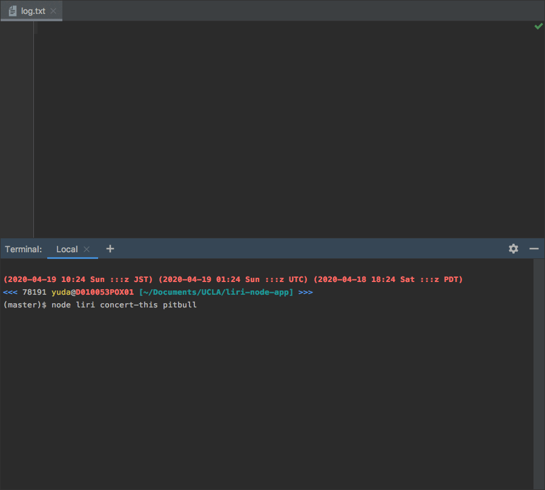
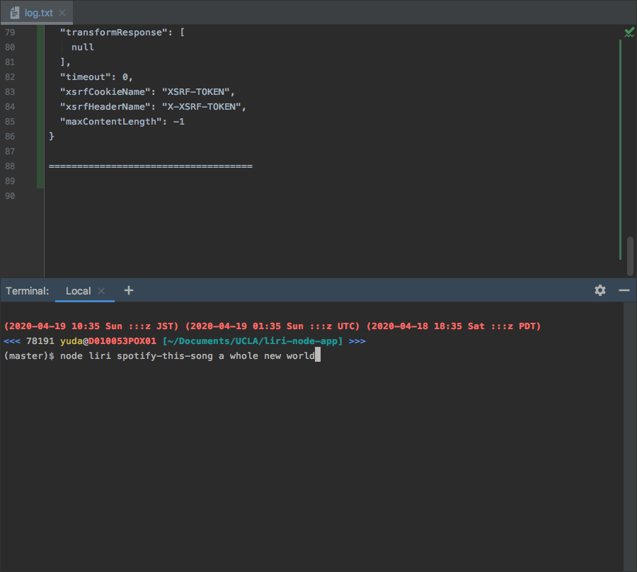
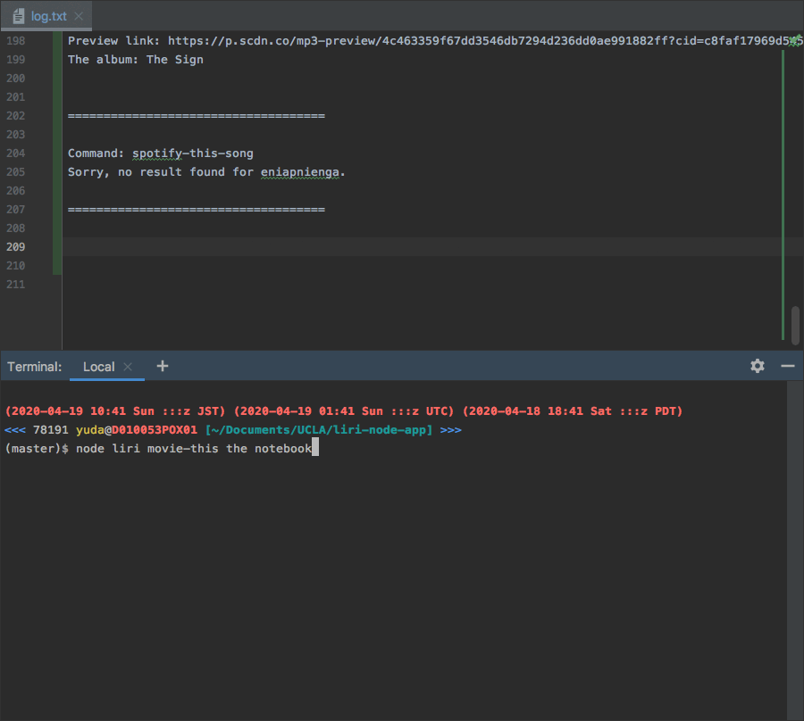
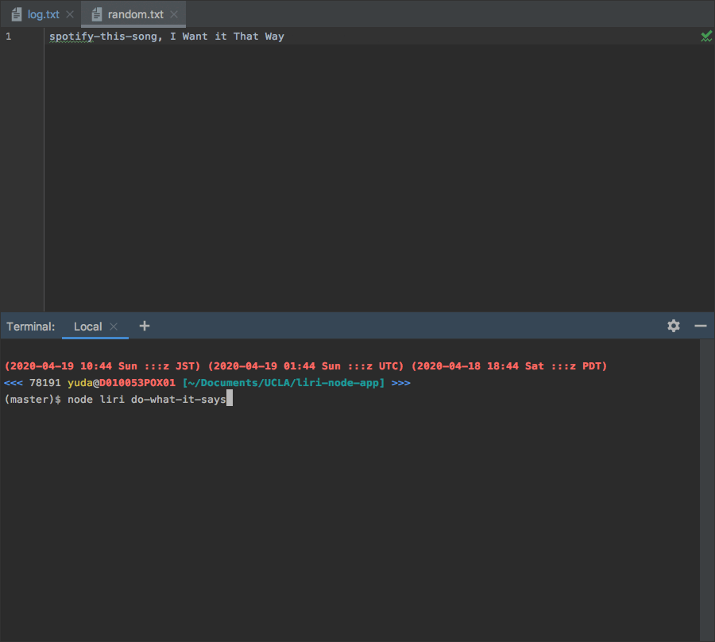

# LIRI Bot

### Overview
LIRI is like iPhone's SIRI. 
However, while SIRI is a Speech Interpretation and Recognition Interface, 
LIRI is a Language Interpretation and Recognition Interface. 
LIRI will be a command line node app that takes in parameters and gives you back data.

### Links
- [Link to the code](https://github.com/yuda0110/liri-node-app)


### Tech/framework used

- JavaScript
- Node
- [Node-Spotify-API](https://www.npmjs.com/package/node-spotify-api)
- [Axios](https://www.npmjs.com/package/axios)
- [Moment](https://www.npmjs.com/package/moment)
- [DotEnv](https://www.npmjs.com/package/dotenv)
- [fs](https://www.npmjs.com/package/fs)

### API reference
- [Spotify API](https://developer.spotify.com/documentation/web-api/)
- [OMDB API](http://www.omdbapi.com/)
- [Bands In Town API](https://www.artists.bandsintown.com/bandsintown-api)

### How to use the app
1. Go to the root directory of the app.
2. Run `npm install` in the terminal.
3. Create `.env` file in the root directory, add the following to it, replacing the values with your Spotify's API keys (no quotes) once you have them:
```bazaar
# Spotify API keys

SPOTIFY_ID=your-spotify-id
SPOTIFY_SECRET=your-spotify-secret

```
4.　Type in one of the commands listed in the "What each command should do" section.

#### How to generate a client id and client secret for Spotify
1. Visit https://developer.spotify.com/my-applications/#!/
2. Either login to your existing Spotify account or create a new one (a free account is fine) and log in.
3. Once logged in, navigate to https://developer.spotify.com/my-applications/#!/applications/create to register a new application to be used with the Spotify API. You can fill in whatever you'd like for these fields. When finished, click the "complete" button.
4. On the next screen, scroll down to where you see your `client id` and `client secret`.

### What each command should do
1.`node liri.js concert-this <artist/band name here>`

Renders the following information about each event to the terminal, and writes logs to "log.txt":

* Name of the venue
* Venue location
* Date of the Event (use moment to format this as "MM/DD/YYYY")

###### Demo


2.`node liri.js spotify-this-song <song name here>`

Renders the following information  about the song to the terminal, and writes logs to "log.txt":

* Artist(s)
* The song's name
* A preview link of the song from Spotify
* The album that the song is from

If no song is provided then the program will default to "The Sign" by Ace of Base.

###### Demo


3.`node liri.js movie-this <movie name here>`

Renders the following information about the movie to the terminal, and writes logs to "log.txt":

* Title of the movie.
* Year the movie came out.
* IMDB Rating of the movie.
* Rotten Tomatoes Rating of the movie.
* Country where the movie was produced.
* Language of the movie.
* Plot of the movie.
* Actors in the movie.

If the user doesn't type a movie in, the program will output data for the movie 'Mr. Nobody.'

###### Demo


4.`node liri.js do-what-it-says`

LIRI will take the text inside of random.txt and then use it to call one of LIRI's commands:

`concert-this`
`spotify-this-song`
`movie-this`

###### Demo


